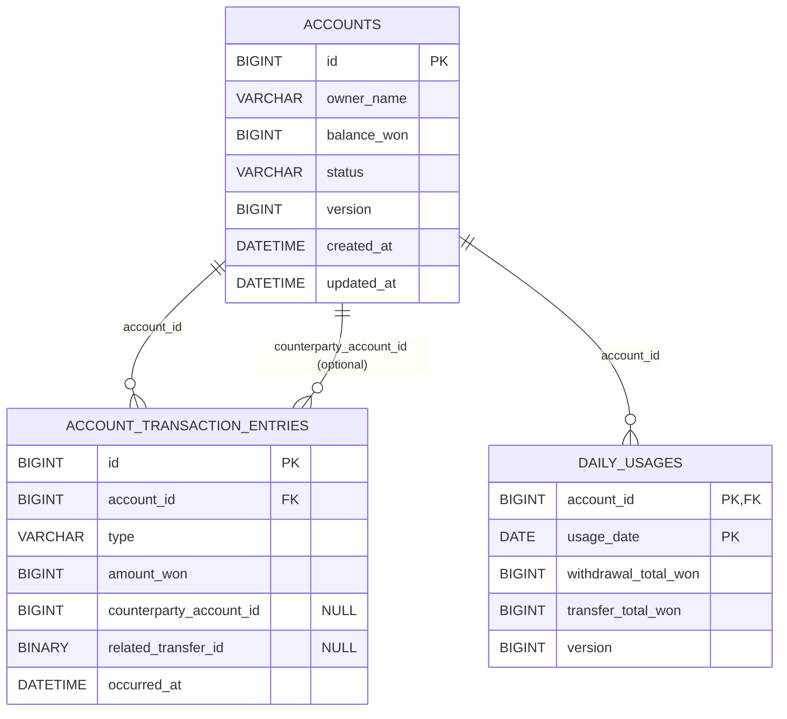

# 데이터 모델

## 1. ERD



## 2. 테이블 상세 설계
- `accounts`: 계좌의 상태/잔액 관리 (현재 상태)
- `account_transaction_entries`: 거래 내역 저장 (감사/추적 목적의 원장 로그)
- `daily_usages`: 일 한도 검증을 위한 일자별 누적 합계

### 2.1 accounts (계좌)

| 컬럼 | 타입 | 제약조건 | 설명 |
|------|------|----------|------|
| id | BIGINT | PK, AUTO_INCREMENT | 계좌 ID |
| owner_name | VARCHAR(50) | NOT NULL | 소유자명 |
| balance_won | BIGINT | NOT NULL, DEFAULT 0 | 잔액(원) |
| status | VARCHAR(20) | NOT NULL, DEFAULT 'ACTIVE' | ACTIVE / DELETED |
| version | BIGINT | NOT NULL, DEFAULT 0 | 낙관적 락 버전 |
| created_at | DATETIME(6) | NOT NULL | 생성일시 |
| updated_at | DATETIME(6) | NOT NULL | 수정일시 |

- `status`는 soft delete를 위한 필드이며, 실제 삭제 대신 `DELETED`로 변경한다.
- 잔액은 `BIGINT`(원 단위)로 관리한다.

```sql
CREATE TABLE accounts (
    id BIGINT AUTO_INCREMENT PRIMARY KEY,
    owner_name VARCHAR(50) NOT NULL,
    balance_won BIGINT NOT NULL DEFAULT 0,
    status VARCHAR(20) NOT NULL DEFAULT 'ACTIVE',
    version BIGINT NOT NULL DEFAULT 0,
    created_at DATETIME(6) NOT NULL,
    updated_at DATETIME(6) NOT NULL,

    INDEX idx_accounts_status (status)
);
```

### 2.2 account_transaction_entries (거래 내역)

| 컬럼 | 타입 | 제약조건 | 설명 |
|------|------|----------|------|
| id | BIGINT | PK, AUTO_INCREMENT | 거래 ID |
| account_id | BIGINT | NOT NULL, FK | 계좌 ID |
| type | VARCHAR(20) | NOT NULL | 거래 유형 |
| amount_won | BIGINT | NOT NULL | 거래 금액 |
| counterparty_account_id | BIGINT | NULL | 상대 계좌 ID |
| related_transfer_id | BINARY(16) | NULL | 이체 묶음 ID(UUID) |
| occurred_at | DATETIME(6) | NOT NULL | 거래 일시 |

**거래 유형**
- `DEPOSIT`: 입금
- `WITHDRAWAL`: 출금
- `TRANSFER_OUT`: 이체 출금
- `TRANSFER_IN`: 이체 입금
- `FEE`: 수수료

- 거래 내역은 계좌 기준으로 조회되는 경우가 많아 `(account_id, occurred_at)` 복합 인덱스를 둔다.
- 이체는 출금/입금/수수료를 하나의 작업으로 묶어서 추적하기 위해 `related_transfer_id`를 사용한다.

```sql
CREATE TABLE account_transaction_entries (
    id BIGINT AUTO_INCREMENT PRIMARY KEY,
    account_id BIGINT NOT NULL,
    type VARCHAR(20) NOT NULL,
    amount_won BIGINT NOT NULL,
    counterparty_account_id BIGINT NULL,
    related_transfer_id BINARY(16) NULL,
    occurred_at DATETIME(6) NOT NULL,

    INDEX idx_entries_account_occurred (account_id, occurred_at DESC),
    INDEX idx_entries_transfer_id (related_transfer_id),

    CONSTRAINT fk_entries_account
        FOREIGN KEY (account_id) REFERENCES accounts(id)
);
```

### 2.3 daily_usages (일일 사용량)

| 컬럼 | 타입 | 제약조건 | 설명 |
|------|------|----------|------|
| account_id | BIGINT | PK, FK | 계좌 ID |
| usage_date | DATE | PK | 사용 일자 |
| withdrawal_total_won | BIGINT | NOT NULL, DEFAULT 0 | 당일 출금 합계 |
| transfer_total_won | BIGINT | NOT NULL, DEFAULT 0 | 당일 이체 합계 |
| version | BIGINT | NOT NULL, DEFAULT 0 | 낙관적 락 버전 |

- 일 한도 검증 시 거래 내역을 매번 합산하지 않도록, 계좌/일자 단위로 누적 값을 유지한다.
- PK를 `(account_id, usage_date)`로 두어 upsert(생성/갱신) 흐름을 단순화한다.

```sql
CREATE TABLE daily_usages (
    account_id BIGINT NOT NULL,
    usage_date DATE NOT NULL,
    withdrawal_total_won BIGINT NOT NULL DEFAULT 0,
    transfer_total_won BIGINT NOT NULL DEFAULT 0,
    version BIGINT NOT NULL DEFAULT 0,

    PRIMARY KEY (account_id, usage_date),

    CONSTRAINT fk_daily_usage_account
        FOREIGN KEY (account_id) REFERENCES accounts(id)
);
```